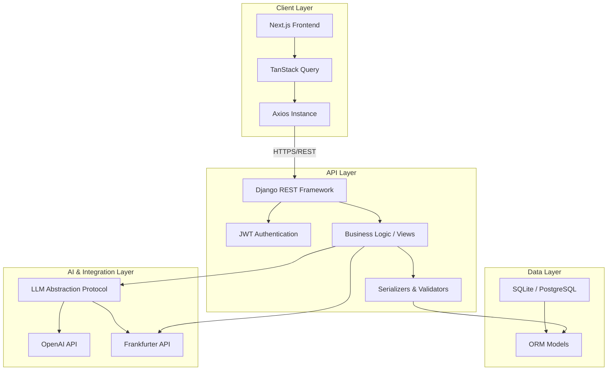

# Budgetika Architecture

This document outlines the architectural decisions, data flow, and system design principles behind Budgetika. The system is built on a decoupled, service-oriented architecture that prioritizes data sovereignty, scalability, and AI-readiness.

## 1. System Overview

Budgetika is a full-stack financial management platform consisting of two primary components: a Django-based RESTful API backend and a Next.js-based Single Page Application (SPA) frontend. The architecture is designed to be lightweight enough for self-hosting on a mini-PC while remaining robust enough for production deployment.

### Core Design Principles

- **Data Sovereignty:** The system is designed to run entirely on-premises or self-hosted, giving the user complete control over their financial data. No third-party data aggregators (like Plaid) are strictly required, although the architecture supports them.
- **Decoupled Presentation:** The frontend communicates with the backend exclusively via a RESTful API secured by JSON Web Tokens (JWT). This separation allows the frontend to be rewritten or replaced without altering the core business logic.
- **AI-Ready Abstractions:** The AI integration layer is built as a protocol-based abstraction (`LLMProvider`), allowing seamless swapping between OpenAI, Anthropic, or local models without changing the core business logic.
- **Eventual Consistency for AI:** AI categorization and processing are designed to be asynchronous or batched, ensuring that the core financial transaction processing remains fast and deterministic.

## 2. High-Level Architecture Diagram

## 3. Component Breakdown

### 3.1. Frontend (Next.js 15 / React 19)

The frontend is built using Next.js to leverage server-side rendering (SSR) and server components where applicable, while relying on React 19 for the interactive UI.

- **State Management:** TanStack Query is used for all server state (fetching transactions, wallets, categories). This provides built-in caching, optimistic updates, and background refetching. Local UI state (e.g., form inputs, modal visibility) is managed via React's `useState` and `useReducer`.
- **API Communication:** All API requests are routed through a centralized Axios instance (`frontend/api/axiosInstance.ts`), which handles JWT injection, error normalization, and timeout handling.
- **UI Components:** The UI is built using Tailwind CSS and Radix UI primitives, ensuring high accessibility and a consistent design system.

### 3.2. Backend (Django 5.1 / DRF)

The backend is responsible for all business logic, data persistence, and third-party integrations.

- **Authentication:** JWT authentication is handled via `djangorestframework-simplejwt`. The frontend stores the access token in memory (via Axios interceptors) and the refresh token securely.
- **ORM & Database:** The system uses Django's ORM. The database schema is designed around a `Wallet` entity, which acts as the primary container for all financial activities (`Transaction`, `BudgetRule`, `RecurringTransaction`).
- **Financial Calculations:** Balances are never stored as a static number. They are calculated dynamically (`initial_value + SUM(transactions)`). This prevents race conditions and ensures data integrity, even if historical transactions are modified.

### 3.3. AI Integration Layer

Budgetika features a custom AI abstraction layer (`wallets/ai.py`) designed to manage LLM interactions safely and cost-effectively.

- **Provider Protocol:** The `LLMProvider` protocol defines a standard interface for AI calls. This allows the system to switch between OpenAI (`OpenAIAdapter`) and other providers without altering the view logic.
- **Quota Management:** Every AI call is logged to the `AIUsageLog` model. The `AIService` checks the user's monthly token quota before making a request. If the quota is exceeded, a `QuotaExceededError` is raised, returning an HTTP 429 status.
- **Batch Processing:** For CSV imports, the system deduplicates transaction descriptions and sends them to the LLM in a single batch (`AI_IMPORT_BATCH_SIZE`), optimizing token usage and reducing latency.

## 4. Data Flow & Critical Paths

### 4.1. Transaction Creation Flow

1. The user submits a new transaction via the frontend `TransactionDialog`.
2. The frontend sends a `POST` request to `/api/transactions/`.
3. The backend `TransactionCreate` view validates the payload using `TransactionSerializer`.
4. The `Wallet` entity's `initial_value` is not modified; the transaction is simply inserted.
5. The frontend's TanStack Query invalidates the wallet metrics cache, triggering a refetch.
6. The backend calculates the new balance dynamically and returns it to the frontend.

### 4.2. Wallet Transfer Flow

A transfer is not a single transaction but a pair of linked transactions.

1. The user initiates a transfer from Wallet A to Wallet B.
2. The backend generates a unique `transfer_ref` (UUID).
3. The backend creates two `Transaction` records:
   - Transaction 1: Negative amount in Wallet A, linked to `transfer_ref`.
   - Transaction 2: Positive amount in Wallet B, linked to `transfer_ref`.
4. The frontend renders these transfers distinctly (with arrow icons and directional labels) by querying the `transfer_peer` relationship.

### 4.3. CSV Import & AI Categorization

1. The user uploads a CSV file via the `CSVImportDialog`.
2. The backend parses the CSV using a generic column mapper and returns a preview.
3. The frontend requests AI categorization via `POST /api/wallets/{id}/import/categorize/`.
4. The backend deduplicates the transaction notes, sends them to the LLM, and maps them to the user's existing categories.
5. The user reviews the mappings in the UI.
6. Upon execution, the backend applies the mappings and commits the transactions to the database.

## 5. Scalability and Future Enhancements

While currently optimized for single-user self-hosting, the architecture supports future scaling:

- **Database Upgrade:** The system can transition from SQLite to PostgreSQL simply by changing the `DATABASE_URL` environment variable. The ORM handles the schema translation seamlessly.
- **Open Banking Integration:** The `LLMProvider` and generic CSV mappers can be extended to support real-time bank API integrations (e.g., Plaid).
- **Multi-tenant Support:** The current `user` ForeignKey relationships on all models provide a solid foundation for converting the system into a multi-tenant SaaS application.
